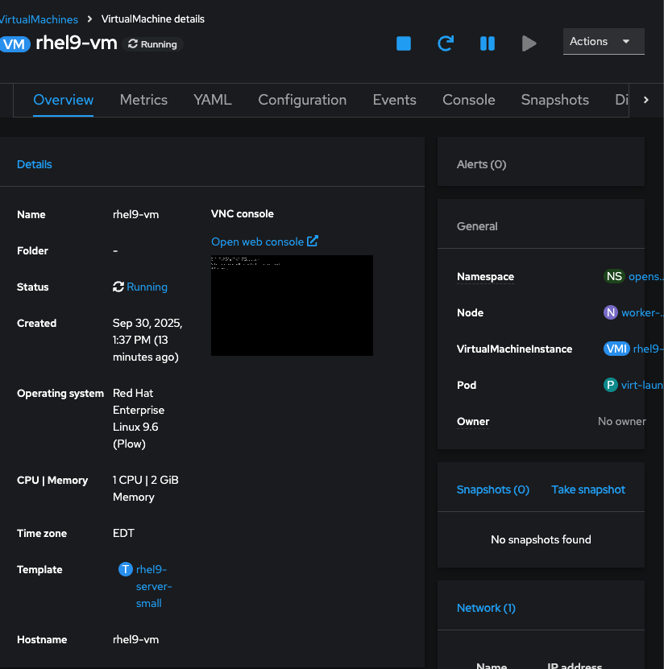
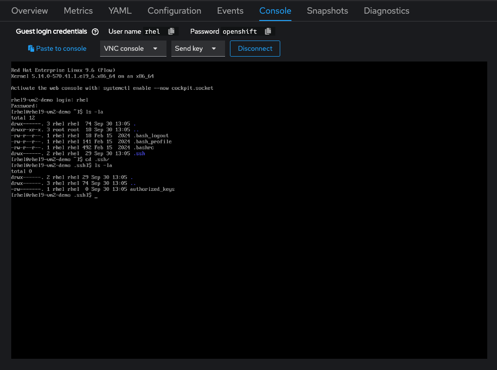
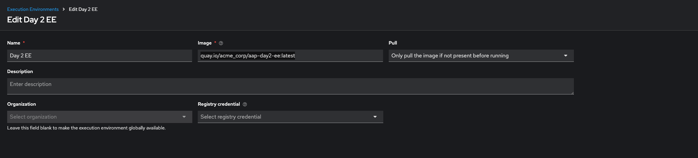
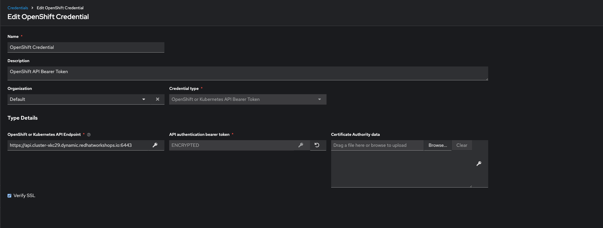
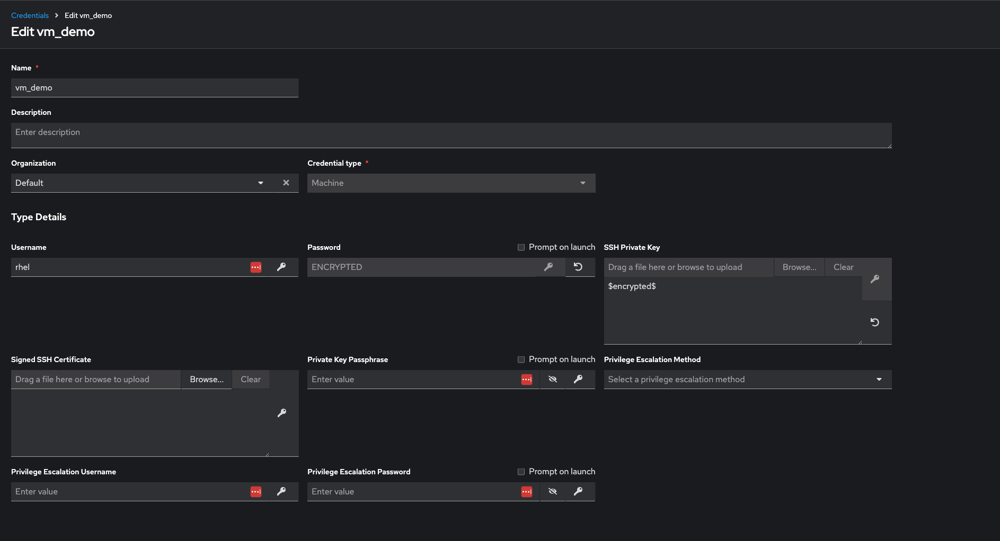
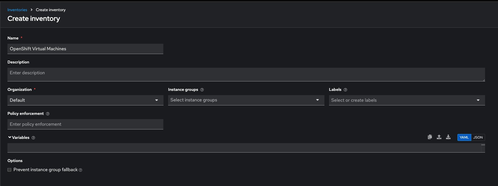
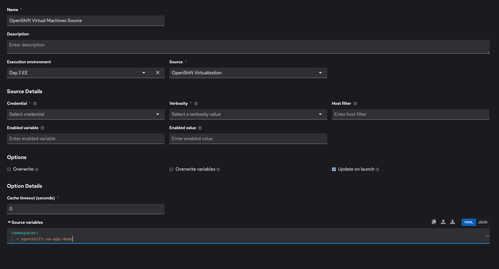
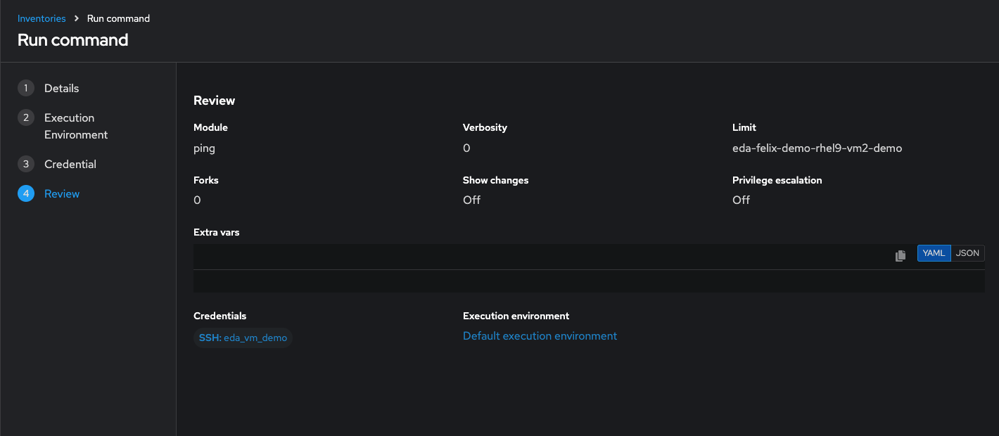
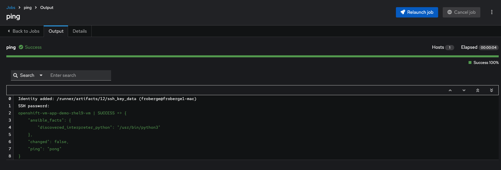

# OpenShift Virtualization and Ansible Automation Platform

This repository contains information on how to set up your Ansible Automation Platform to be able to manage Virtual machine created with OpenShift Virtualization Platform.

## Required
* An instance of OpenShift Running with the OpenShift Virtualization operator
* An instance of Ansible Automation Running.


## Demo

This demo created a new `RHEL` virtual machine in OpenShift Virtualization so we can manage it using Ansible Automation Platform after.

## Steps.

#### Configure OpenShift

###### Using the OpenShift CLI

1. First we need to create an `SSH Key` localy so we can add it to the virtual machine and have ansible use it to connect. 
    ```
    ssh-keygen -t rsa -f [REPLACE_BY_NAME_OF_THE_KEY_YOU_WANT]
    ```
1. Create the project in OpenShift we will use
    ```
    oc apply -f manifest/create-demo-project.yaml
    ```
1. Get the public key and add it to this [file](manifest/create-secret-ssh-key-vm.yaml)
1. Create the secret in the project to link to the VM
    ```
    oc apply -f manifest/create-secret-ssh-key-vm.yaml
    ```
1. Create the new VM
    ```
    oc apply -f manifest/create-rhel9-vm.yaml
    ```

###### Using the OpenShift Web Console

1. Validate that all the artifacts created above are there and that your VM is Running


1. You can connect to the VM, you should see the `.ssh` folder


----

#### Configure Ansible Automation Platform.

Now that we have a VM running, we want to be able to interact with it using Ansible Automation Platform

1. Create an execution environment using this images. ` quay.io/acme_corp/aap-day2-ee:latest`.


1. Create a credential to connect to OpenShift.

:warning: change the endpoint to reflect your environment.

1. Create the credential to connect to the VM. For this you need to use the private key you created earlier and the username password of the VM.


1. Now lets create the Dynamic Inventory
   1. Go to Inventory/Create Inventory
      * Name: OpenShift Virtual Machines
      * Organization: Default
   

   1. Add the Source to the Inventory. Go to the inventory->sources->Create Source
       * Name: OpenShift Virtual Machines Source
       * Environment: Day 2 EE
       * Source: OpenShift Virtualization 
       * Credential: OpenShift Credential
       * Update on launch Checkbox: Checked
       * Cache timeout (seconds): 0
       * in the YAML box add
         ```
            namespaces:
                - openshift-vm-app-demo
          ```
        
    1. Sync the inventory once created.
        
  
1. We can now test that we can access the VM with AAP.
   1. Go to the inventory
   1. Go to host
   1. Check the desire host and click the `Run Command` button
   1. Select the ping Module, than Next
   1. Select the Day 2 EE created earlier, than Next
   1. Select the Machine credential created earlier, than Next
   1. Review and click Finish
   


:tada: You should get a screen like that


