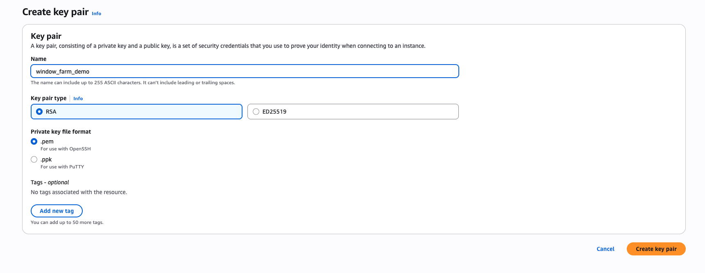
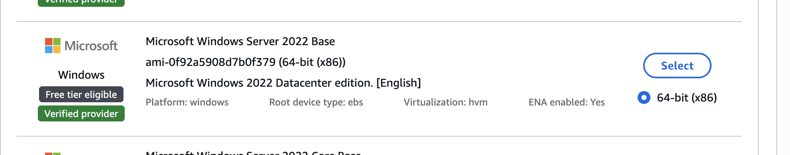
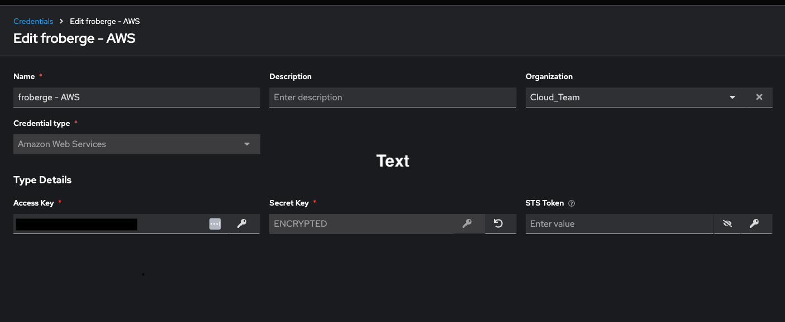
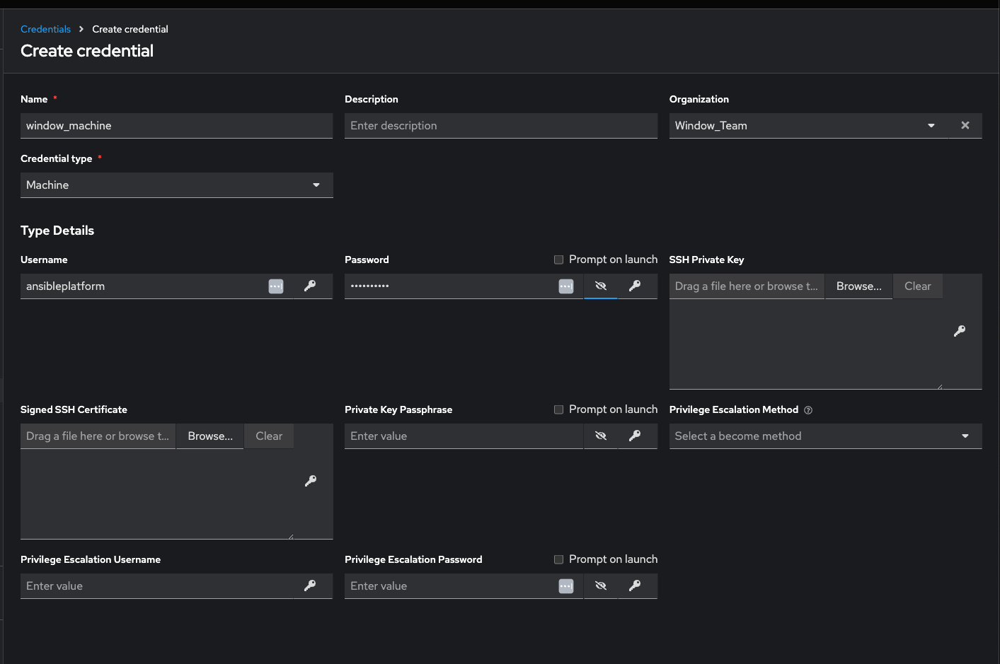
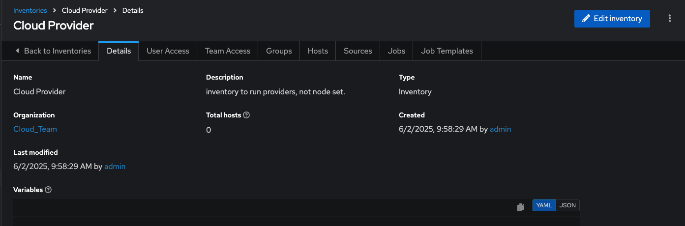
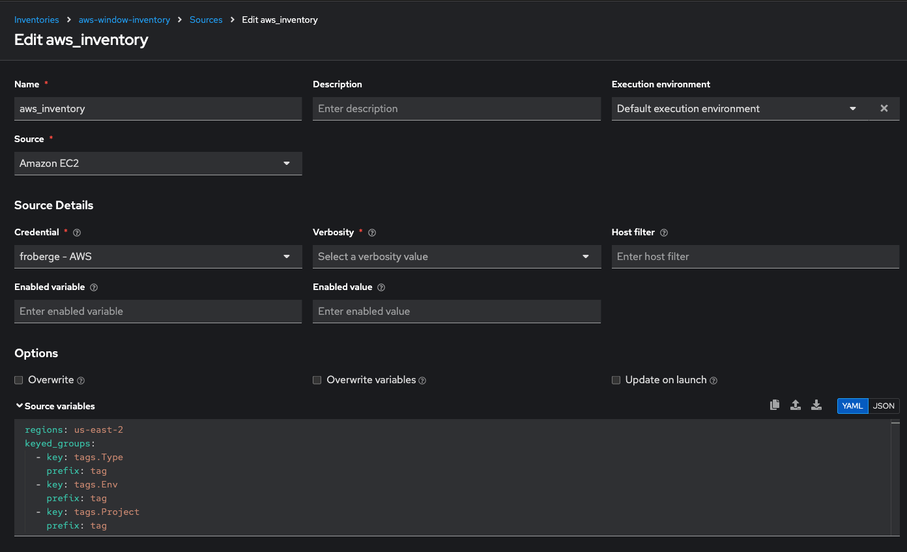
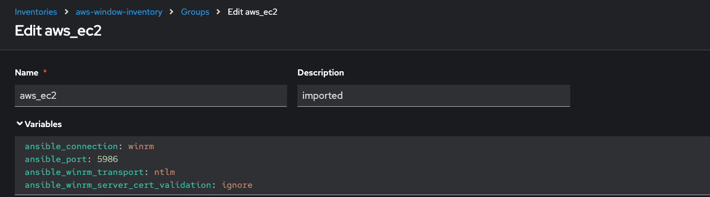
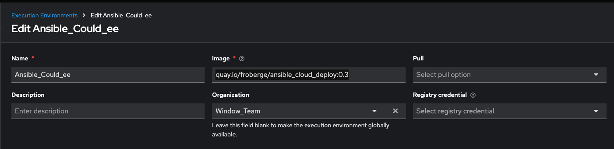
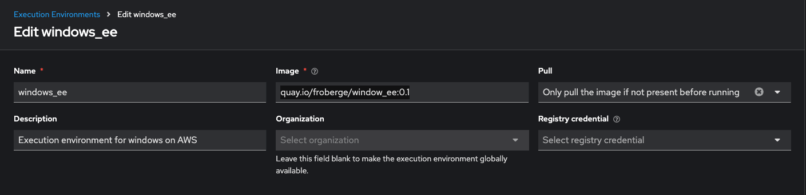
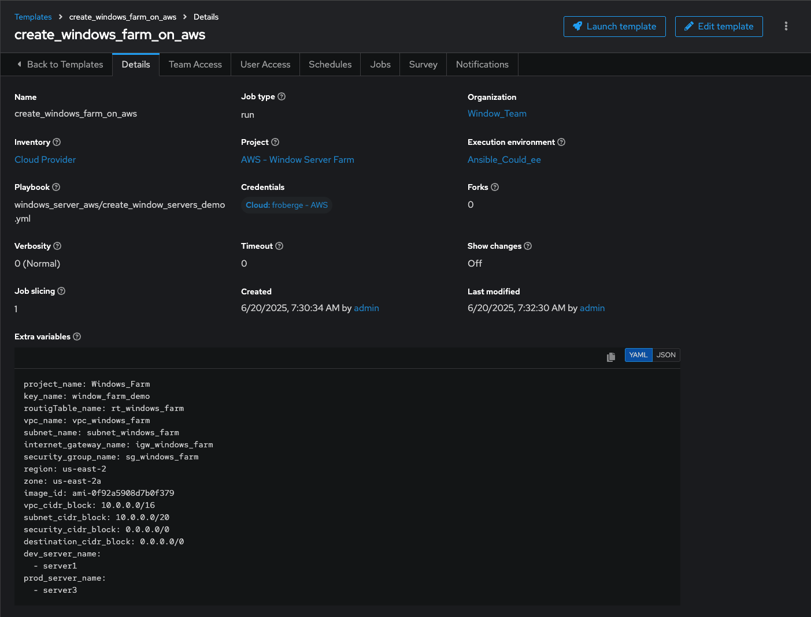

## AWS Execution environment, Playbook and Roles

Here is an example how to create with ansible-playbool a AWS environment that will host a VM with a windows server install in it.


#### Available playbooks
* [Create Window Server Demo](create_window_servers_demo.yml)
* [Delete Window Server Demo](delete_window_server_demo.yml)

#### Required

1. An AWS enviroment and credentials.
1. Different element for python and ansible need to be added in order to execute this outside of an execution environment.

    Ansible collection:
    * Amazon Community.
    ``` ansible-galaxy collection install community.aws```
    * Amazon Certify 
    ``` ansible-galaxy collection install amazon.aws ```

    Python libraries:
    * None

1. Create a Key Pairs in AWS and download the .pem file. Use that name for variable in the value-local.yml file. In this demo the key is by default call `window_farm_demo`. If you change it make sure to change the variable so it is reflect everywhere.


1. Select which AMI to install. Currently this demo uses that one for windows.



#### Execute Local

:warning: Lot's of var have been externalize to represent running in a real environment, they must be provider to the playbook in order to work.

1. Create the values-local.yml file to run locally.
:exclamation: __COPY__ the file `inventory/values.yml` into a local file like `values-local.yml` and use that to provide the variable to the playbooks. The following variable absolutely needs to be overwritten.
    * AWS_ACCESS_KEY_ID
    * AWS_SECRET_KEY

1. Add this 2 lines in every task in order to call AWS.
```
        access_key: "{{ AWS_ACCESS_KEY_ID }}"
        secret_key: "{{ AWS_SECRET_KEY }}"
```

1. Run the desired playbook
```
ansible-playbook -i inventory/values-local.yml [desired playbook]
```

#### Execute Ansible Automation Platform

###### Setup
1. Create a credential with your AWS information


1. Create a credential with the machine information to connect to the newly created window VM


1. Create a dummy inventory for local cloud.


1. Create a dynamic inventory. To do so, create a dynamic source.

value for mapping:
    ```
    regions: us-east-2
    keyed_groups:
    - key: tags.Type
        prefix: tag
    - key: tags.Env
        prefix: tag
    - key: tags.Project
        prefix: tag
    ```

1. :warning: Once you have done the first sync. In groups you need to enter the values in order to use `winRM` to connect to the windowsV VM for automation. This values are enter in the `aws_ec2` group.

  variable:
    ```
    ansible_connection: winrm
    ansible_port: 5986
    ansible_winrm_transport: ntlm
    ansible_winrm_server_cert_validation: ignore
    ```
1. Create 2 execution environment.
  * First to execute on AWS. `quay.io/froberge/ansible_cloud_deploy:0.3`
  
    
  * Second to run windows tasks. `quay.io/froberge/window_ee:0.1`
  

###### To Run the project that create the infra.

1. Create the project project 
1. Create the required template. You can use the value [here](../inventory/values.yml) for the extra variables.

1. Run the template
1. Sync the inventory

:star2: You now have an infra of window machine on AWS.  Enjoy !!!


###### Available playbook on the once created.

To know what is available win the collection `win_update` check the [window update collection page, ](https://docs.ansible.com/ansible/latest/collections/ansible/windows/win_updates_module.html) which give great examples.

###### Existing Playbook

- [Search for required Update](../search_win_update.yml)
- [Install security update]( ../install_security_update.yml)
- [Install some packages](../install_software_window.yml)
- [Delete AWS infra](../delete_window_server_demo.yml)